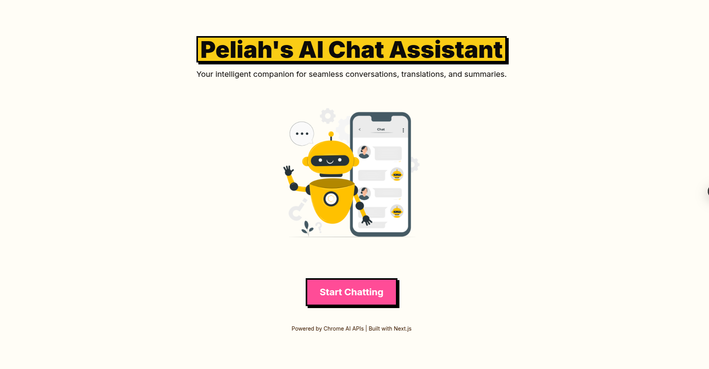
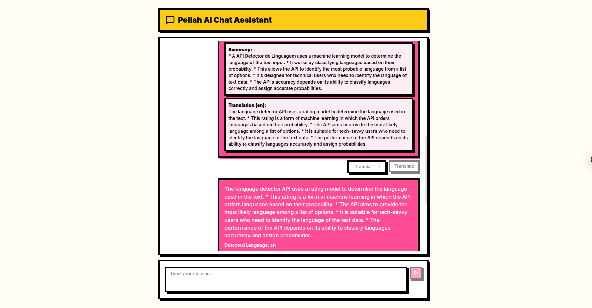

# Peliah's Chrome AI Chat Assistant



**Peliah's Chrome AI Chat Assistant** is a modern, AI-powered chat application built with **Next.js** and integrated with **Chrome's AI APIs**. It provides features like **language detection**, **text summarization**, and **translation**, all wrapped in a sleek **Neo-Brutalism** design.

---

## Features

- **Language Detection**: Automatically detect the language of user messages.
- **Text Summarization**: Summarize long messages into concise summaries.
- **Translation**: Translate messages into multiple languages.
- **Neo-Brutalism Design**: Bold, modern, and visually striking UI.
- **Responsive Design**: Works seamlessly on desktop, tablet, and mobile devices.

---

## Technologies Used

- **Frontend**:
  - Next.js (App Router)
  - React
  - Tailwind CSS
- **Backend**:
  - Next.js API Routes
- **AI APIs**:
  - Chrome Language Detection API
  - Chrome Summarizer API
  - Chrome Translator API

---

## Getting Started

Follow these steps to set up and run the project locally.

### Prerequisites

- Node.js (v16 or higher)
- npm or yarn
- Chrome AI API key (sign up at [Chrome AI Developer Portal](https://developer.chrome.com/docs/ai))

### Installation

1. **Clone the repository**:
   ```bash
   git clone https://github.com/Peliah/ai-chrome-chatbot.git
   cd ai-chrome-chatbot
   ```

2. **Install dependencies**:
   ```bash
   npm install
   # or
   yarn install
   ```

3. **Set up environment variables**:
   Create a `.env.local` file in the root directory and add your Chrome AI API key:
   ```plaintext
    NEXT_PUBLIC_SUMMARIZER_API_TOKEN='YOUR_SUMMARIZER_API_TOKEN'
    NEXT_PUBLIC_LANGUAGE_DETECTOR_API_TOKEN='YOUR_LANGUAGE_DETECTOR_API_TOKEN'
    NEXT_PUBLIC_TRANSLATOR_API_TOKEN='YOUR_TRANSLATOR_API_TOKEN'

   ```

4. **Run the development server**:
   ```bash
   npm run dev
   # or
   yarn dev
   ```

5. **Open the application**:
   Visit `http://localhost:3000` in your browser.

---

## Project Structure (App Router)

```
peliah-chat-assistant/
├── app/                     # Next.js App Router
│   ├── chat/                # Chat page route
│   │   └── page.tsx         # Chat page
│   ├── api/                 # API routes
│   │   ├── detect-language/ # Language detection API
│   │   │   └── route.ts
│   │   ├── summarize/       # Summarization API
│   │   │   └── route.ts
│   │   └── translate/       # Translation API
│   │       └── route.ts
│   ├── layout.tsx           # Root layout
│   └── page.tsx             # Landing page
├── components/              # Reusable components
│   ├── ImageSlider.tsx      # Image slideshow component
│   ├── MessageInput.tsx     # Chat input component
│   └── MessageList.tsx      # Chat message list component
├── public/                  # Static assets (images, etc.)
│   └── images/              # Images for the slideshow
├── styles/                  # Global styles
│   └── globals.css
├── tailwind.config.js       # Tailwind CSS configuration
├── package.json             # Project dependencies
└── README.md                # This file
```

---

## Usage

### Landing Page

- The landing page features a **dynamic image slideshow** and a **Call-to-Action (CTA)** button to start chatting.
- The slideshow automatically transitions between images and loops infinitely.

### Chat Page

- **Send Messages**: Type your message in the input box and press Enter or click the send button.
- **Language Detection**: The app automatically detects the language of your message.
- **Summarize**: Click the "Summarize" button to generate a concise summary of long messages.
- **Translate**: Select a target language from the dropdown and click "Translate" to translate the message.

---

## Customization

- **Change Images**: Replace the images in the `public/images` folder with your own.
- **Update Colors**: Modify the colors in `tailwind.config.js` to match your brand.
- **Add Languages**: Update the language options in the `MessageItem` component.

---

## Contributing

Contributions are welcome! If you'd like to contribute, please follow these steps:

1. Fork the repository.
2. Create a new branch (`git checkout -b feature/your-feature`).
3. Commit your changes (`git commit -m 'Add some feature'`).
4. Push to the branch (`git push origin feature/your-feature`).
5. Open a pull request.

---

## License

This project is licensed under the MIT License. See the [LICENSE](LICENSE) file for details.

---

## Acknowledgments

- **Chrome AI APIs**: For providing powerful language detection, summarization, and translation capabilities.
- **Next.js**: For enabling fast and scalable web applications.
- **Tailwind CSS**: For simplifying the styling process.

---

## Screenshots

### Landing Page


### Chat Page


---

Enjoy using **Peliah's Chrome AI Chat Assistant**! If you have any questions or feedback, feel free to open an issue or contact the maintainers.

---
